<<<<<<< HEAD
# 🚀 AI-Driven Customer Insights Platform

<div align="center">


**Yapay Zeka Destekli Müşteri Analiz ve Tahmin Platformu**

[](https://github.com/betulguner/churn-insights)
[](https://github.com/betulguner/churn-insights)

</div>

---

## 🎯 Proje Amacı

Bu platform, şirketlerin **CRM verilerini** kullanarak müşteri davranışlarını anlamasını, gelecek davranışlarını tahmin etmesini ve **aksiyon alınabilir içgörüler** üretmesini sağlar. Klasik dashboardlardan farklı olarak, platformun yapay zeka destekli bir **"Insight Chatbot"** özelliği bulunmaktadır.

### 🌟 Yenilikçi Özellikler

- 🤖 **AI Chatbot**: "Son 3 ayda en çok kar getiren müşteri segmenti kim?" gibi sorulara RAG ile cevap
- 📊 **Gerçek Zamanlı Analiz**: PostgreSQL → BigQuery → BI Dashboard zinciri
- 🔄 **Otomatik ETL**: Veri işleme ve senkronizasyon süreçleri
- 📈 **Gelişmiş Segmentasyon**: ML tabanlı müşteri gruplandırma
- 🎯 **Churn Prediction**: Müşteri kaybı tahmin modelleri

---

## 🏗️ Sistem Mimarisi

```mermaid
graph TB
    A[📁 CSV Data] --> B[🔄 ETL Pipeline]
    B --> C[🐘 PostgreSQL<br/>Docker Container]
    C --> D[☁️ BigQuery<br/>Cloud Data Warehouse]
    D --> E[📊 BI Dashboards<br/>Tableau & PowerBI]
    D --> F[🤖 AI Chatbot<br/>RAG System]
    
    G[🐳 Docker Compose] --> C
    H[📋 pgAdmin] --> C
    I[🔧 Prefect Orchestration] --> B
    
    style A fill:#e1f5fe
    style C fill:#f3e5f5
    style D fill:#fff3e0
    style E fill:#e8f5e8
    style F fill:#fce4ec
```



---

## 📁 Proje Yapısı

```
churn-insights/
├── 🐳 docker/                    # Docker konfigürasyonları
│   ├── docker-compose.yml        # PostgreSQL + pgAdmin setup
│   └── docker_setup.sh           # Otomatik kurulum scripti
├── 🗄️ database/                  # Veritabanı şemaları
│   └── database_schema.sql       # PostgreSQL DDL (7 tablo + 2 view)
├── ☁️ bigquery/                  # BigQuery entegrasyonu
│   ├── bigquery_integration.py   # Veri senkronizasyon scripti
│   ├── bigquery_schema.sql       # BigQuery DDL (9 tablo + 4 view)
│   └── BIGQUERY_SETUP_GUIDE.md   # Detaylı kurulum rehberi
├── 🐍 scripts/                   # Python scriptleri
│   ├── etl_pipeline.py          # ETL süreci (Extract-Transform-Load)
│   └── test_bigquery.py         # BigQuery bağlantı testleri
├── 📚 docs/                      # Dokümantasyon
│   └── ETL_FLOW_DESIGN.md       # ETL süreç tasarımı
├── 🧪 tests/                     # Test dosyaları
├── 📊 data/                      # Veri dosyaları
│   └── WA_Fn-UseC_-Telco-Customer-Churn.csv
├── ⚙️ .env                       # Environment variables
├── 📋 requirements.txt           # Python dependencies
└── 📖 README.md                  # Bu dosya
```

---

## 🚀 Hızlı Başlangıç

### 📋 Gereksinimler

- **Docker & Docker Compose** (PostgreSQL için)
- **Python 3.13+** (ETL ve BigQuery için)
- **Google Cloud Platform** hesabı (BigQuery için)
- **Git** (Kod yönetimi için)

### ⚡ Kurulum Adımları

#### 1️⃣ Repository'yi Klonlayın

```bash
git clone https://github.com/betulguner/churn-insights.git
cd churn-insights
```

#### 2️⃣ Python Environment Kurulumu

```bash
# Virtual environment oluştur
python -m venv churn_env

# Activate et
source churn_env/bin/activate  # Linux/Mac
# churn_env\Scripts\activate  # Windows

# Dependencies yükle
pip install -r requirements.txt
```

#### 3️⃣ Environment Variables Ayarlayın

```bash
# Environment dosyasını kopyala
cp env.example .env

# .env dosyasını düzenle
nano .env  # veya herhangi bir editör
```

**Önemli**: `.env` dosyasında Google Cloud credentials'larınızı ayarlayın:
```env
GCP_PROJECT_ID=your-project-id
GOOGLE_APPLICATION_CREDENTIALS=path/to/your/service-account-key.json
```

#### 4️⃣ Docker ile PostgreSQL Başlatın

```bash
cd docker
docker compose up -d

# Container'ların çalıştığını kontrol et
docker compose ps
```

#### 5️⃣ ETL Pipeline'ı Çalıştırın

```bash
cd scripts
python etl_pipeline.py
```

#### 6️⃣ BigQuery Entegrasyonunu Başlatın

```bash
cd bigquery
python bigquery_integration.py
```

---

## 📊 Veri Analizi Sonuçları

### 📈 Churn Analizi
- **Toplam Müşteri**: 7,043
- **Churn Oranı**: %26.54
- **Churn Olan Müşteri**: 1,869
- **Veri Kalitesi**: %100 (eksik veri yok)

### 🎯 Müşteri Segmentasyonu

| Segment | Müşteri Sayısı | Ortalama CLTV | Açıklama |
|---------|----------------|---------------|----------|
| 🏆 **High Value Loyal** | 1,139 | $4,964 | En değerli ve sadık müşteriler |
| 💼 **Medium Value Stable** | 1,546 | $2,908 | Orta değerli, kararlı müşteriler |
| 👥 **Standard** | 1,695 | $2,049 | Standart müşteri segmenti |
| ⚠️ **High Risk** | 1,641 | $1,371 | Churn riski yüksek müşteriler |
| 🆕 **New Customers** | 1,022 | $179 | Yeni müşteri segmenti |

### 🔍 Churn Risk Faktörleri

**En Yüksek Churn Oranları:**
- Month-to-month + Fiber optic: **54.61%**
- Month-to-month + DSL: **32.22%**
- One year + Fiber optic: **19.29%**

**En Düşük Churn Oranları:**
- Two year + No internet: **0.78%**
- Two year + DSL: **1.91%**
- One year + No internet: **2.47%**

---

## 🔧 Kullanım Kılavuzu

### 🗄️ pgAdmin ile Veritabanı Yönetimi

- **URL**: http://localhost:8080
- **Email**: admin@churn.com
- **Password**: admin123

**Bağlantı Ayarları:**
- Host: `localhost`
- Port: `5433`
- Database: `churn_analysis`
- Username: `churn_user`
- Password: `churn_password`

### ☁️ BigQuery Console

- **Project ID**: `churn-471614`
- **Dataset**: `churn_analysis`
- **Tablolar**: 9 ana tablo + 4 analitik view

### 📝 Örnek SQL Sorguları

#### Churn Oranı Analizi
```sql
SELECT 
  COUNT(*) as total_customers,
  COUNT(CASE WHEN churn_status = true THEN 1 END) as churned_customers,
  ROUND(COUNT(CASE WHEN churn_status = true THEN 1 END) * 100.0 / COUNT(*), 2) as churn_rate
FROM customer_churn;
```

#### Müşteri Segmentasyonu Analizi
```sql
SELECT 
  segment_name,
  COUNT(*) as customer_count,
  AVG(cltv_score) as avg_cltv,
  COUNT(CASE WHEN churn_status = true THEN 1 END) as churned_count
FROM customer_segments cs
JOIN customer_churn cc ON cs.customer_id = cc.customer_id
GROUP BY segment_name
ORDER BY avg_cltv DESC;
```

#### Aylık Churn Trendi
```sql
SELECT 
  DATE_TRUNC(created_at, MONTH) as month,
  COUNT(*) as total_customers,
  COUNT(CASE WHEN churn_status = true THEN 1 END) as churned_customers,
  ROUND(COUNT(CASE WHEN churn_status = true THEN 1 END) * 100.0 / COUNT(*), 2) as churn_rate
FROM customer_churn
GROUP BY month
ORDER BY month;
```

---

## 🛠️ Teknoloji Yığını

### 🗄️ Veri Katmanı
- **PostgreSQL 15+** (Operasyonel veritabanı)
- **Google BigQuery** (Analitik veri ambarı)
- **Docker & Docker Compose** (Containerization)

### 🔄 ETL & Orchestration
- **Python 3.13+** (Ana programlama dili)
- **pandas** (Veri işleme)
- **SQLAlchemy** (ORM)
- **Prefect** (Workflow orchestration - gelecek)

### ☁️ Cloud & DevOps
- **Google Cloud Platform** (BigQuery, Cloud Run)
- **Docker** (Containerization)
- **GitHub Actions** (CI/CD - gelecek)

### 📊 Analytics & BI
- **Tableau** (Dashboard - gelecek)
- **PowerBI** (Dashboard - gelecek)
- **scikit-learn** (ML modelleri - gelecek)

### 🤖 AI & LLM
- **LangChain** (RAG framework - gelecek)
- **OpenAI API** (LLM - gelecek)
- **ChromaDB** (Vector database - gelecek)

---

## 🗓️ Geliştirme Roadmap

### ✅ Tamamlanan (Hafta 1)
- [x] Docker PostgreSQL setup
- [x] ETL pipeline (CSV → PostgreSQL)
- [x] BigQuery entegrasyonu
- [x] Veri kalitesi kontrolleri
- [x] Temel analitik sorgular

### 🚧 Devam Eden (Hafta 2)
- [ ] Prefect ile ETL orchestration
- [ ] Machine Learning modelleri
- [ ] Churn prediction algoritması
- [ ] Customer segmentation (KMeans)

### 📋 Planlanan (Hafta 3-4)
- [ ] RAG tabanlı AI Chatbot
- [ ] Tableau & PowerBI dashboard'ları
- [ ] CI/CD pipeline (GitHub Actions)
- [ ] Google Cloud Run deployment
- [ ] API endpoints (FastAPI)

---

## 🤝 Katkıda Bulunma

Bu proje açık kaynaklıdır ve katkılarınızı memnuniyetle karşılıyoruz!

### 🚀 Nasıl Katkıda Bulunabilirsiniz?

1. **Fork** yapın
2. **Feature branch** oluşturun (`git checkout -b feature/amazing-feature`)
3. **Değişikliklerinizi** commit yapın (`git commit -m 'Add amazing feature'`)
4. **Branch'inizi** push yapın (`git push origin feature/amazing-feature`)
5. **Pull Request** oluşturun

### 🐛 Bug Report

Bir hata bulduysanız, lütfen [Issues](https://github.com/betulguner/churn-insights/issues) bölümünden bildirin.

---

## 📄 Lisans

Bu proje [MIT License](LICENSE) altında lisanslanmıştır.

---

## 👥 İletişim & Destek

<div align="center">

**Proje Sahibi**: Betül Güner

[](https://github.com/betulguner)
[](https://linkedin.com/in/betulguner)
[](mailto:betulguner@example.com)

</div>

---

## 🌟 Yıldız Verin!

Bu projeyi beğendiyseniz, ⭐ yıldız vermeyi unutmayın!

---

<div align="center">

**Bu proje, Data Analyst, Data Engineer, ML Engineer ve BI Developer rollerinde güçlü bir referans olarak tasarlanmıştır.**

*"Data is the new oil, but AI is the refinery."* 🚀

</div>
=======
# churn-insights
>>>>>>> 35a4ca8c194e85e116035f084e36753bc908b907
